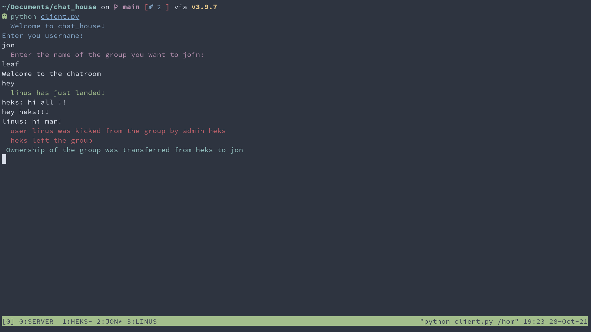

# Chat House

A simple terminal-based localhost chat application written in python

## How to Use? 
- Clone the repo

```bash
git clone https://github.com/heksadecimal/chat_house.git
```

- Start the server in one window
```bash
python server.py
```

- Add as many users you want 
```bash
python client.py
```

### Some helpful special commands that can be used in the application
(special commands are denoted using `!` in front of them)

| command       | Description                                                                                       | Example       |
| :---          |:---------------                                                                                   |          :--- |
| quit          | Used to quit the group                                                                            | !quit   |
| whosonline    | shows a list of people who are online in the group                                                | And more      |
| strength      | Shows the number of people in the group                                                           | !strength   |
| kick*         | Used to kick user(s) from the group using a comma-seperated list                                  | !kick jon,linus   |
| destruct*     | Used to destory the group                                                                         | !destruct   |
| makeowner*    | Change ownership/admin of the group                                                               | !makeowner jon   |
| whosadmin     | Shows who is the current admin                                                                    | !whosadmin   |
| whoswaiting** | Show the list of users waiting to be accepted                                                     | !whoswaiting   |
| accept**      | Used to accept user(s) from the waiting list of the group using a comma-seperated list            | !accept person1,person2   |
| reject**      | Used to reject user(s) from the waiting list of the group using a comma-seperated list            | !reject person1,person2   |
| mute*         | Used to mute user(s) of the group using a comma-seperated list                                    | !mute person1,person2   |
| unmute*       | Used to unmute user(s) from the waiting list of the group using a comma-seperated list            | !unmute person1,person2   |

- (*)   Only admin
- (**)  Only admin and in a private group

Here are some screenshots:

- User Heks


- User Jon

